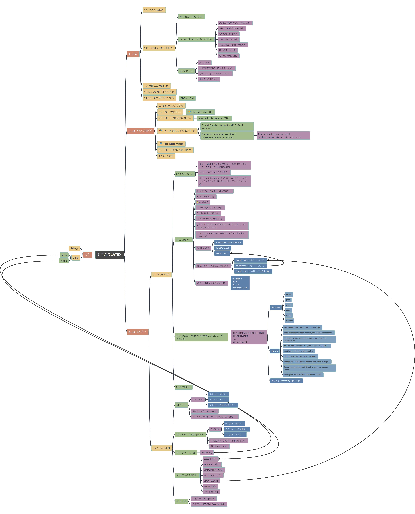

# Simple & Effective LATEX 简单高效LATEX

Author: 吴康隆

## Tutorial Videos List

| Video Title | YouTube | Bilibili (B站) | Youku 优酷网 | ixigua 西瓜视频 |
| --- | --- | --- | --- | --- |
| Full List | [link](https://www.youtube.com/playlist?list=PL6DEHvciXKeVW_Ipyogb1Ydpvk_9E6Twc) | To be added | | [合集链接](https://www.ixigua.com/7298100920137548288?&&id=7298102008853201460)|
| Learn_LaTeX_001_Opening 简单高效LATEX | [link](https://youtu.be/ZUSUxvFfMG0) | [link](https://www.bilibili.com/video/BV1pj411Y7PF/) | [link](https://v.youku.com/v_show/id_XNjE1NzA3MTk5Ng==.html) | [link](https://www.ixigua.com/7298100920137548288?id=7298101059350692415&logTag=7a231fa3ec2d4715c403) |
| Learn LaTeX 002 - LaTex Environment Setup 工具安装与环境配置 | [link](https://youtu.be/TDAoSSsx13I) | TBA | [link](https://v.youku.com/v_show/id_XNjE1MzYwMzQ0OA==.html?) | [link](https://www.ixigua.com/7298100920137548288?id=7298102008853201460&logTag=90bf9acb42f1676fecf5) |
| Learn LaTeX 003 - LaTex Environment Setup Error Fix 环境安装的问题解决 | [link](https://youtu.be/kxrWP7eDDLI) | TBA | | [link](https://www.ixigua.com/7298100920137548288?id=7298102386571084323&logTag=11aba8be1207d4324c96) |
| Learn LaTeX 004 - LaTex Command / Environment and Reserved Chars | [link](https://youtu.be/S3ZsA0taido) | TBA | | [link](https://www.ixigua.com/7298100920137548288?id=7298102807985390120&logTag=648645768678d38c1ed2) |

## Mindmap of the book

[mindmap file in FreePlane](simple_latex.mm)

Exported mindmap static image:

